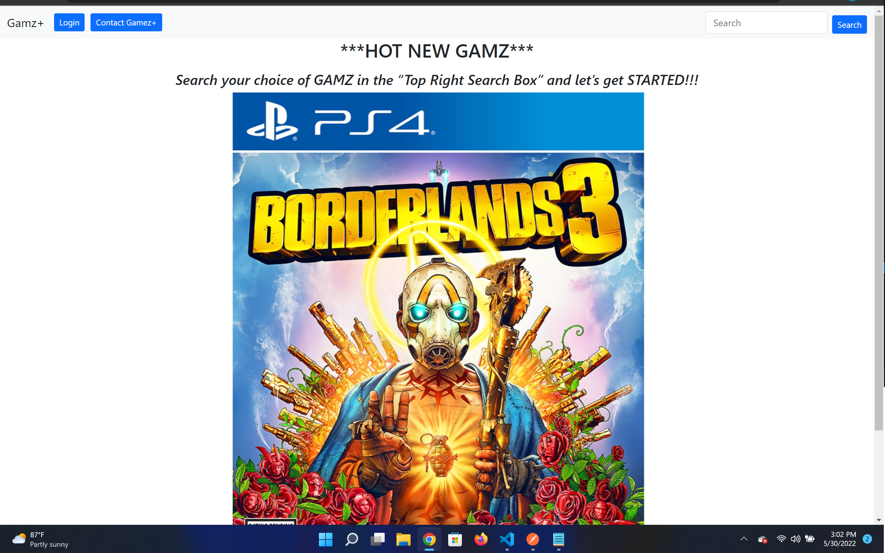
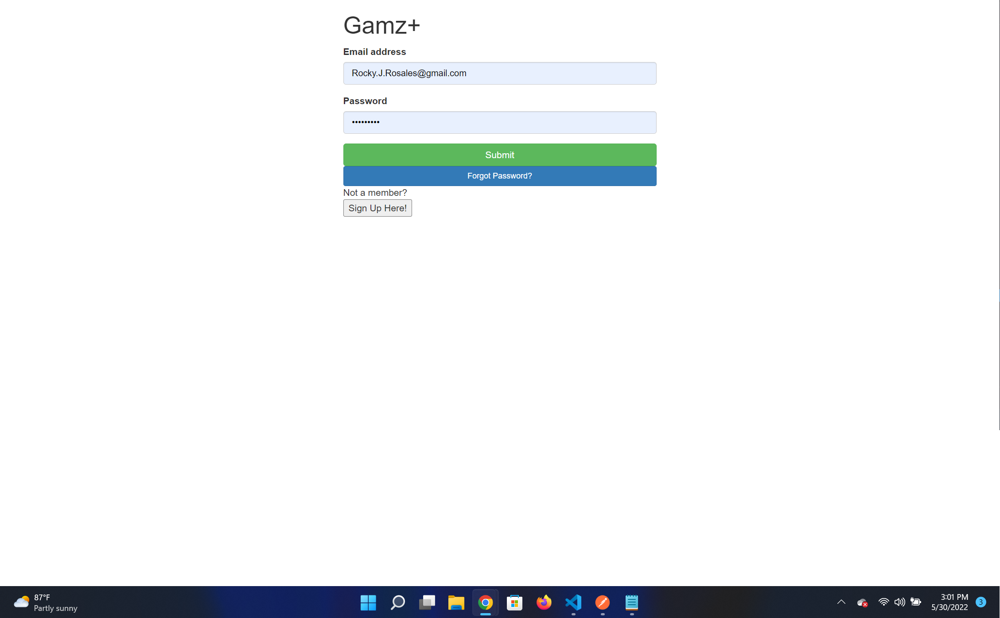

# Gamz+:

Welcome to the one and only GAMZ+ where you have the control to look and view a plethora of different variety of GAMZ. We are using https://rawg.io/ Api to grab/view/store data in our backend and made it user-friendly in the frontend for all users. 

- How to use our App:
   - Users can type their choice of GAMZ in the “Top Right Search Box” to view variety of games.

   - To fully use all functions of our App. An user has to create a "Login" 
   -  Once signed in, an user can:
         - "Add" their choice of game/games in a "Favorite List"
         - "Delete" a game/games from that list.
         - "Add a Rank" from best to least ranging from 1-5.  

## Gamz+ HerokuApp Webpage:
   - <a href="https://gamz2022.herokuapp.com/home">Link to our Live Website</a>
            

## NPM Packages Used:
- Nodemon
- Sequelize
- Sequelize-cli
- Postgres
- Express
- Express-es6-template-engine
- Body-parser
- Method-override
- Bcrypt
- Node-fetch
- PG
- PG-promise
- Winston

## Project Screenshot(s):

- HomePage:

- LoginPage:

- Search Results/ Add to Favorites Page:

- Add a Rank and Delete Page:

- Contact Us Page:

## Developers:

 - Rocky Rosales
    - [LinkedIn](https://www.linkedin.com/in/rocky-rosales-25b4491b4/)
    - [Github](https://github.com/RJRHOU)
    - 

 - Zaid Syed
    -  [LinkedIn](https://www.linkedin.com/in/zaid-syed-5a29261b4/)
    -  [Github](https://github.com/ZaidSyed22)
    -  

 - Onyinye Okwuosa
    -  [LinkedIn](https://www.linkedin.com/in/onyinye-okwuosa-csm-303a27a8/)
    - [Github](https://github.com/okwuosa34)
    - 
